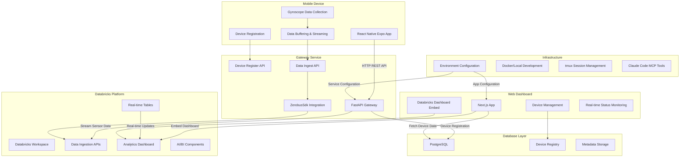

# Chicago Vibe Coding Workshop - System Architecture

This document outlines the high-level architecture and technology stack for the Chicago Vibe Coding Workshop application, a real-time device tracking system with gyroscope data streaming to Databricks.

## Architecture Diagram

# Technology Stack & Value Proposition

## Frontend Applications

### React Native Expo
- **Purpose**: Cross-platform mobile app for device registration and sensor data collection
- **Value**: 
  - Unified codebase for iOS/Android deployment
  - Direct access to device sensors (gyroscope, accelerometer)
  - Hot reload development experience
  - Over-the-air updates capability

### Next.js 14 (App Router)
- **Purpose**: Web dashboard for device management and analytics visualization
- **Value**:
  - Server-side rendering for optimal performance
  - API routes for backend functionality
  - Modern React patterns with app directory structure
  - Built-in TypeScript support and optimization

## Backend Services

### FastAPI (Python)
- **Purpose**: Gateway service handling device registration and data ingestion
- **Value**:
  - High-performance async API framework
  - Automatic API documentation with OpenAPI/Swagger
  - Strong type safety with Pydantic models
  - Easy integration with Python data ecosystem

### PostgreSQL
- **Purpose**: Relational database for device registry and metadata
- **Value**:
  - ACID compliance for reliable transactions
  - Strong consistency for device management
  - Powerful querying capabilities
  - Databricks native connectivity

## Data Platform

### Databricks
- **Purpose**: Unified analytics platform for real-time data processing and visualization
- **Value**:
  - Lakehouse architecture combining data lake flexibility with warehouse performance
  - Real-time streaming capabilities via Delta Live Tables
  - AI/BI embedded dashboard components
  - ZerobusSdk for high-throughput data ingestion
  - Built-in ML/AI capabilities for advanced analytics

### ZerobusSdk
- **Purpose**: High-performance streaming client for Databricks ingestion
- **Value**:
  - Optimized for high-throughput data streaming
  - Protocol buffer efficiency for serialization
  - Automatic batching and retry mechanisms
  - Native Databricks integration

## Development & Infrastructure

### Claude Code with MCP Tools
- **Purpose**: AI-assisted development environment
- **Value**:
  - Intelligent code generation and refactoring
  - Integration with tmux for session management
  - Automated testing and deployment workflows
  - Context-aware development assistance

### tmux Session Management
- **Purpose**: Persistent development environment management
- **Value**:
  - Long-running process isolation
  - Concurrent service development
  - Session persistence across network interruptions
  - Organized development workflows

### TypeScript
- **Purpose**: Type-safe development across frontend applications
- **Value**:
  - Compile-time error detection
  - Enhanced IDE support and autocomplete
  - Better code maintainability
  - Reduced runtime errors

## Architecture Benefits

### Real-time Data Pipeline
The architecture enables end-to-end real-time data flow from mobile sensors 
to analytics dashboards with minimal latency.

### Scalable Ingestion
FastAPI + ZerobusSdk combination provides high-throughput data ingestion 
capable of handling thousands of concurrent mobile devices.

### Developer Experience
Modern tooling (Next.js, Expo, FastAPI, Claude Code) provides excellent 
developer experience with hot reload, type safety, and automated workflows.

### Analytics-Ready
Direct integration with Databricks provides immediate analytics capabilities 
without complex ETL processes.

### Cross-platform Deployment
React Native enables single codebase deployment to iOS and Android, 
while Next.js provides web access for administrators.

## Data Flow

1. **Registration**: Mobile app registers device via FastAPI gateway
2. **Collection**: Gyroscope data collected at 100ms intervals
3. **Buffering**: Data buffered locally and submitted every 5 seconds
4. **Streaming**: FastAPI forwards batched data to Databricks via ZerobusSdk
5. **Processing**: Databricks processes real-time streams into analytics tables
6. **Visualization**: Next.js dashboard displays real-time device analytics

This architecture demonstrates modern full-stack development practices with AI-assisted coding, real-time data streaming, and cloud-native analytics.